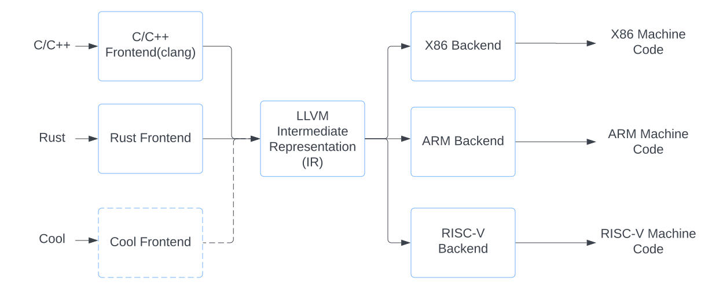

# Writing a Compiler Using LLVM
This tutorial will explore the implementation of [Cool](https://dl.acm.org/doi/10.1145/381841.381847) programming language using LLVM. Cool source code will be turned into executable machine code. If you are new to compiler 
constructions there are few text books and references (free) in the Reference section. 

The topics covered are in this tutorial are:
* Introduction to Cool
* Introduction to LLVM
* Creating the compiler frontend for Cool using ANTLR
* Using LLVM libraries to generate machine codes for Cool
* Generating the debug information for source level debugging for Cool programs

[LLVM]() implements large number of optimizations that produce better, fast machine codes. The source code for this tutorial (cool-llvm) is available at https://github.com/rajikak/cool-llvm.

# Introduction to Cool
`Cool` (stands for Classroom Object Oriented Language) is programming langauge designed by [Prof. Alexander Aiken](http://theory.stanford.edu/~aiken/) for use in an undergraduate compiler course project. 
So it can be implemented within a short period of time, but also rich enough to understand most aspects of an engineering a compiler. `Cool`'s features includes:
* Static type system
* Object orientation
* Abstractions 
* Re-use (inheritance)
* Memory management

## Cool Syntax 
* `Cool` source files have the extension `.cl` 
* Every `Cool` program has a class called `Main` 
* Every class declaration is terminated by `;`
* Every `Main` class should have a no argument `main()` method. That's where the program execution starts
* Every method declaration is terminated by `;`
* Every method signature is terminated by `:`
 
Here's the full langauge syntax in BNF and regular expression format (see the full syntax list in the [Cool's manual](./assets/cool-manual.pdf)): 
```
program ::= [class;]+
class   ::= class TYPE [inherits TYPE] { [feature; ]* } 
feature ::= ID( [ formal [, formal]*] ) : TYPE { expr }
          | ID:TYPE [ <- expr ] 
formal  ::= ID : TYPE
expr    ::= ID <- expr
          | expr[@TYPE].ID( [ expr [, expr]*] ) | ID( [ expr [, expr]*] )
          | if expr then expr else expr fi
          | while expr loop expr pool
          | { [expr; ]+ }
          | let ID:TYPE [ <- expr ] [,ID:TYPE [ <- expr ]]* in expr | case expr of [ID : TYPE => expr; ]+esac
          | new TYPE
          | isvoid expr
          | expr + expr
          | expr − expr
          | expr ∗ expr
          | expr / expr
          | ~expr
          | expr < expr
          | expr <= expr
          | expr = expr
          | not expr
          | (expr)
          | ID
          | integer
          | string
          | true
          | false
```

Here's a hello world `Cool` program (`hello-world.cl`): 
```
-- This is a Cool hello world program
class Main inherits IO {
	main(): Object {
		out_string("hello, world\n")
	};
};
```

Compile and run the program using `cool` compiler:
```
$ cool hello-world.cl
hello, world
```

Here's another `Cool` program with a syntax error(`syntax-error.cl`), that just returns integer 1:
```
class Main {
    main() {
        1        
    };
};
```

Compile the program:
```
$ cool syntax-error.cl
'syntax-error.cl', line 3: syntax error at or near '{'
```

Fix the syntax error, by adding a `: Int`:
```
class Main {
    main(): Int {
        1        
    };
};
```

Compile the program again:
```
$ cool syntax-error.cl
$ 
```

Here's a `Cool` program to calculate factorial (`fact.cl`) using recursion (`fact(i: Int)`) or iterations (`fact1(i: Int)`):
```
class Main inherit A2i{
	main(): Object {
		(new IO).out_string(a2i(fact(new IO().in_string())).contact("\n"));
	};

	fact(i: Int): Int {
		if (i == 0) then 1 else i * fact(i - 1) fi
	};

	(* factorial using iterations *)
	fact1(i: Int): Int {
		let fact: Int <- 1 in {
			while (not (i = 0) loop
				{
				   	fact <- fact * i;
					i <- i - 1;
				};
			pool;
			fact;
		};
	};
};
```

# LLVM
LLVM is a compiler [infrastructure](https://llvm.org/pubs/2008-10-04-ACAT-LLVM-Intro.pdf). LLVM can be used to implement 
compilers for other languages. This is possible because how LLVM is designed to be re-used. LLVM is implemented as a set of re-usable 
compiler components (for e.g. a re-usable X86 code generator so that a new compiler can re-use that code generator). This is the main benefit of LLVM compared to a monolithic 
compiler project like [gcc](https://gcc.gnu.org). 



Figure1: LLVM's modular architecture              

LLVM can be subdivided into three major components: the frontend, the intermediate representation (IR) and the backend. The 
frontend is responsible for translating input source code (for e.g. C/C++, Rust or Cool programs) into LLVM IR. We will look how to write a 
LLVM frontend as part of `Cool` compiler implementation in this tutorial. The IR is the core of the LLVM. The IR provides the most 
significant benefit of LLVM for compiler implementers. The backend component is responsible for translating IR to a specific 
hardware such as the Intel X86 or the ARM architecture. IR acts as the input to the backend and thereby allow compiler writers to 
just to focus on writing a frontend for their language in order to produce a production ready compiler.

## LLVM IR

### Installing 
In order to implement a compiler with LLVM, we need to install LLVM libraries https://llvm.org/docs/GettingStarted.html#getting-started-with-llvm.
I am using below steps for compling and installing LLVM on a Linux system:

Install cmake and add the bin path into `PATH`:                                                  
```
$ wget https://github.com/Kitware/CMake/releases/download/v3.24.2/cmake-3.24.2-linux-x86_64.tar.gz
$ tar -xvf cmake-3.24.2-linux-x86_64.tar.gz
```


```
$ yum install -y git gcc gcc-c++ python zlib make
$ pwd
/home/ec2-user/
$ git clone https://github.com/llvm/llvm-project.git
$ mkdir llvm-project/build
$ cd llvm-project/build
$ cmake -G 'Unix Makefiles' \
        -DCMAKE_BUILD_TYPE=Release \
        -DCMAKE_INSTALL_PREFIX=/home/ec2-user/llvm-project/install \
        -DLLVM_TARGETS_TO_BUILD='X86' \
        -DLLVM_ENABLE_PROJECTS='clang;lldb;lld;mlir;clang-tools-extra;compiler-rt' \
        ../llvm 
$ make;make install
```

### Using LLVM Tool Chain
Let's start with an example to see how to use the LLVM tool chain. Below is a simple C program.

```
// hello.c
#include <stdio.h>

int main() {
    printf("hello world\n");
}
```

Compile this using `clang` and generate the [LLVM IR](https://llvm.org/docs/LangRef.html).
```
$ clang -S -emit-llvm -O3 hello.c
```

This produces the human-readable LLVM IR representation of the program.
```
$ cat hello.ll
@str = private unnamed_addr constant [12 x i8] c"hello world\00", align 1

; Function Attrs: nofree nounwind uwtable
define dso_local i32 @main() local_unnamed_addr #0 {
  %1 = tail call i32 @puts(ptr nonnull dereferenceable(1) @str)
  ret i32 0
}

; Function Attrs: nofree nounwind
declare noundef i32 @puts(ptr nocapture noundef readonly) local_unnamed_addr #1
```

Use LLVM assembler to convert the LLVM IR to LLVM bitcode. Bit code is a binary representation of LLVM IR.
```
$ llvm-as hello.ll -o hello.bc
```

`hexdump` can be used to view the binary LLVM bitcode file.
```
$ hexdump -c hello.bc
0000000   B   C 300 336   5 024  \0  \0 005  \0  \0  \0   b  \f   0   $
0000010   M   Y 276   f 255 373 264   O 033 310   $   D 001   2 005  \0
0000020   !  \f  \0  \0 374 001  \0  \0  \v 002   !  \0 002  \0  \0  \0
0000030 026  \0  \0  \0  \a 201   # 221   A 310 004   I 006 020   2   9
0000040 222 001 204  \f   % 005  \b 031 036 004 213   b 200 020   E 002
0000050   B 222  \v   B 204 020   2 024   8  \b 030   K  \n   2   B 210
0000060   H   p 304   !   #   D 022 207 214 020   A 222 002   d 310  \b
0000070 261 024       C   F 210     311 001   2   B 204 030   *   (   *
0000080 220   1   | 260   \ 221     304 310  \0  \0  \0 211      \0  \0
...
```
 
LLVM disassembler can be used to convert LLVM bitcode file back to LLVM IR.
```
$ llvm-dis hello.bc -o hello.ll
```

LLVM linker can be used to link two or more LLVM bitcode files to output to a single bitcode file.
```
$ llvm-link first.bc second.bc -o combined.bc 
```

LLVM IR compiler `llc` can be used to compile LLVM bitcode to target assembly.
```
$ llc hello.bc -o hello.s
```
```
$ cat hello.s
	.text
	.file	"hello.c"
	.globl	main                            # -- Begin function main
	.p2align	4, 0x90
	.type	main,@function
main:                                   # @main
	.cfi_startproc
# %bb.0:
	pushq	%rax
	.cfi_def_cfa_offset 16
	movl	$.Lstr, %edi
	callq	puts@PLT
	xorl	%eax, %eax
	popq	%rcx
	.cfi_def_cfa_offset 8
	retq
.Lfunc_end0:
	.size	main, .Lfunc_end0-main
	.cfi_endproc
                                        # -- End function
	.type	.Lstr,@object                   # @str
	.section	.rodata.str1.1,"aMS",@progbits,1
.Lstr:
	.asciz	"hello world"
	.size	.Lstr, 12

	.ident	"clang version 16.0.0 (https://github.com/llvm/llvm-project.git 22a4b336a6ff7db1ab5b5b050c452259a3710dae)"
	.section	".note.GNU-stack","",@progbits  
```

LLVM `lli` can be used to execute LLVM bitcode.
```
$ lli hello.bc 
hello world
```      

LLVM optimizer (`opt`) support large number of optimization.
```
$ opt -mem2reg hello.bc -o hello.opt.bc
$ llc hello.opt.bc -o hello.opt.s 
```
```
$ cat hello.opt.s
cat hello.opt.s 
	.text
	.file	"hello.c"
	.globl	main                            # -- Begin function main
	.p2align	4, 0x90
	.type	main,@function
main:                                   # @main
	.cfi_startproc
# %bb.0:
	pushq	%rax
	.cfi_def_cfa_offset 16
	movl	$.Lstr, %edi
	callq	puts@PLT
	xorl	%eax, %eax
	popq	%rcx
	.cfi_def_cfa_offset 8
	retq
.Lfunc_end0:
	.size	main, .Lfunc_end0-main
	.cfi_endproc
                                        # -- End function
	.type	.Lstr,@object                   # @str
	.section	.rodata.str1.1,"aMS",@progbits,1
.Lstr:
	.asciz	"hello world"
	.size	.Lstr, 12

	.ident	"clang version 16.0.0 (https://github.com/llvm/llvm-project.git 22a4b336a6ff7db1ab5b5b050c452259a3710dae)"
	.section	".note.GNU-stack","",@progbits
```

# LLVM Frontend for Cool using ANTLR

# References
* Cool Language
  * [Cool manual](./assets/cool-manual.pdf)([Online](https://web.stanford.edu/class/cs143/materials/cool-manual.pdf))
* Compiler Implementation
  * [CS 143 Compilers](https://web.stanford.edu/class/cs143/)
  * [Compilers (edX)](https://learning.edx.org/course/course-v1:StanfordOnline+SOE.YCSCS1+2T2020/home)
  * [Engineering A Compiler](https://www.amazon.com/Engineering-Compiler-Keith-D-Cooper/dp/0128154128/ref=sr_1_1?keywords=engineering+a+compiler&qid=1666828042&qu=eyJxc2MiOiIxLjcwIiwicXNhIjoiMS40MyIsInFzcCI6IjEuNjkifQ%3D%3D&s=books&sprefix=Engineegin+a+compiler%2Cstripbooks%2C83&sr=1-1)
  * [Modern Compiler Implementation in C](https://www.cs.princeton.edu/~appel/modern/c/)
  * [Writing a C Compiler](https://norasandler.com/2017/11/29/Write-a-Compiler.html)
  * [Writing An Interpreter In Go](https://interpreterbook.com/)
  * [Writing A Compiler In Go](https://compilerbook.com/)
* LLVM
  * [LLVM](http://www.aosabook.org/en/llvm.html)
  * [Getting Started with the LLVM System](https://llvm.org/docs/GettingStarted.html)
  * [Creating an LLVM Project](https://llvm.org/docs/Projects.html)
  * [Mapping High Level Constructs to LLVM IR](https://mapping-high-level-constructs-to-llvm-ir.readthedocs.io/en/latest/a-quick-primer/index.html)
  * https://tomassetti.me/a-tutorial-on-how-to-write-a-compiler-using-llvm/
  * https://llvm.org/docs/tutorial/MyFirstLanguageFrontend/index.html
  * [Compilers and IRs: LLVM IR, SPIR-V, and MLIR](https://www.lei.chat/posts/compilers-and-irs-llvm-ir-spirv-and-mlir/)
  * [Superoptimizing LLVM](https://www.youtube.com/watch?v=Ux0YnVEaI6A)
  * [A Complete Guide to LLVM for Programming Language Creators](https://mukulrathi.com/create-your-own-programming-language/llvm-ir-cpp-api-tutorial/)
  * [How a Go Program Compiles down to Machine Code](https://getstream.io/blog/how-a-go-program-compiles-down-to-machine-code/)
  * [Mapping High Level Constructs to LLVM IR](https://mapping-high-level-constructs-to-llvm-ir.readthedocs.io/en/latest/README.html)
* Lexical Scanning/ANTLR
    * [Lexical Scanning in Go - Rob Pike](https://www.youtube.com/watch?v=HxaD_trXwRE)
    * [Getting Started with ANTLR in C++](https://tomassetti.me/getting-started-antlr-cpp/)
